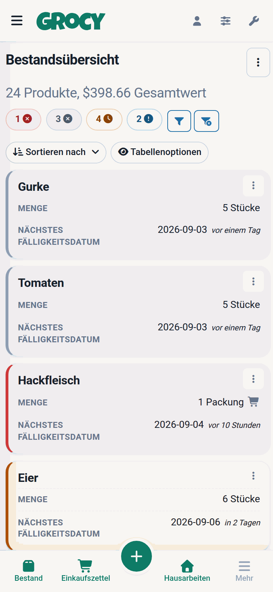
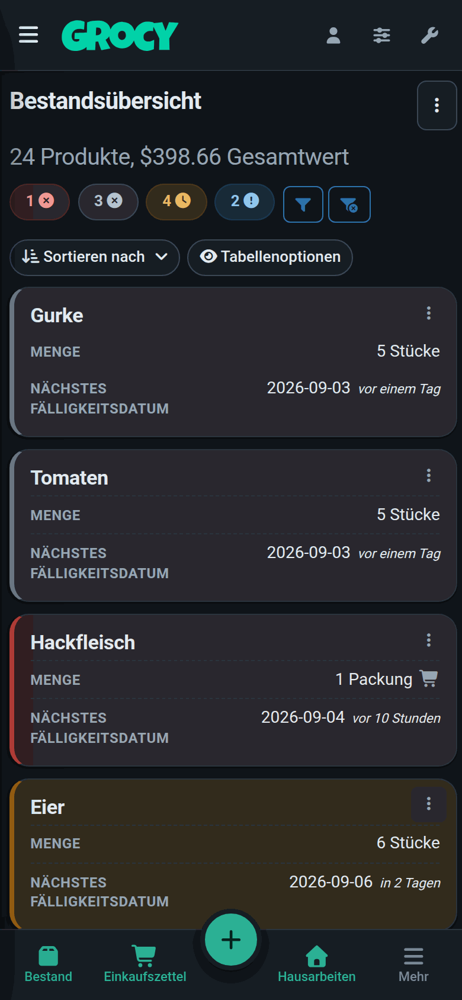
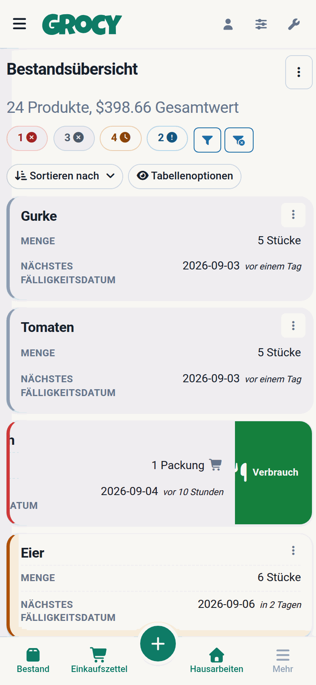
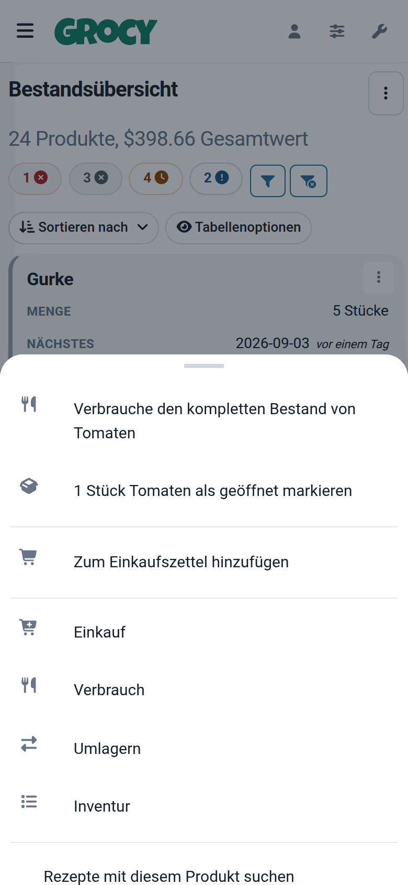
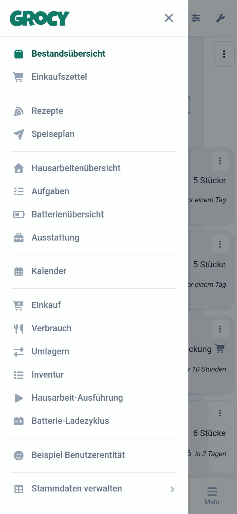
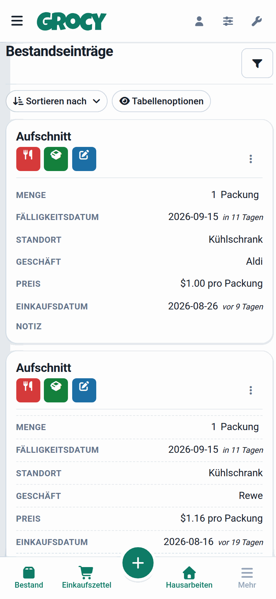
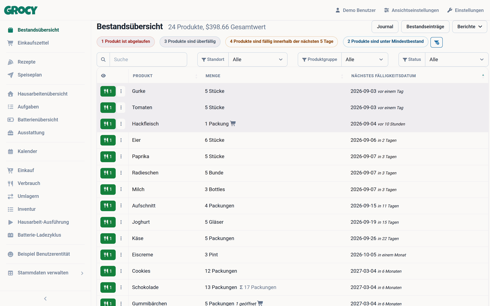

-----

<div align="center">

<h2>Grocy Modern</h2>
<h3>Grocy mit einem modernen, mobile-first Design</h3>
<em><h4>Persönlicher Fork von <a href="https://github.com/grocy/grocy">grocy</a> — dem Haushalts-ERP von <a href="https://berrnd.de">Bernd Bestel</a></h4></em>
</div>

-----

## Worum geht es hier?

[Grocy](https://grocy.info) ist ein hervorragendes selbst gehostetes Haushalts-ERP — Bestände, Einkaufszettel, Rezepte, Speiseplan, Hausarbeiten. Nur die Oberfläche war mir zu altbacken und am Handy zu unhandlich, vor allem die breiten Tabellen.

Dieser Fork ändert **ausschließlich das Frontend**. Funktionsumfang, Datenbank und REST-API sind unverändert — es ist dasselbe Grocy, nur mit neuer Oberfläche.

|  |  |  |
|---|---|---|
|  |  |  |
| Tabellen werden am Handy zu Karten | Dark Mode über dieselben Design-Tokens | Wischen statt Knöpfe suchen |
|  |  |  |
| Zeilenmenüs als Bottom-Sheet | Off-Canvas-Navigation statt aufklappendem Menü | Mehr als zwei Aktionen: eigene Zeile |

<p align="center"></p>
<p align="center"><em>Am Desktop bleibt es eine Tabelle — mit einklappbarer Sidebar</em></p>

## Was ist anders?

**Design-System statt Bootstrap-Standard.** Alle Farben, Radien, Schatten und Typografie sind CSS-Variablen in [`public/css/grocy_theme.css`](public/css/grocy_theme.css). Umfärben heißt: ein paar Variablen überschreiben — am besten in `data/custom_css.html`, dann überlebt es Updates:

```html
<style>
  :root {
    --g-brand: #7c3aed;
    --g-brand-hover: #6d28d9;
    --g-brand-soft: #f0e9fe;
    --g-brand-soft-text: #5b21b6;
  }
</style>
```

**Tabellen werden am Handy zu Karten.** Unter 768 px wird jede DataTable automatisch umgebaut: Produktname als Überschrift, jede Zelle mit ihrem Spaltenkopf beschriftet, Aktionen als Fußzeile, leere Zellen entfallen, Status wird zu einem farbigen Balken. Weil dabei der Tabellenkopf verschwindet, gibt es darüber eine Leiste mit **Sortieren** und **Tabellenoptionen** — beides war am Handy vorher praktisch nicht erreichbar. Das geschieht zentral in [`grocy_datatables.js`](public/js/grocy_datatables.js), keine der 70+ Views musste dafür angefasst werden.

**Neue App-Hülle.** Sticky Topbar, ruhigere Sidebar mit Markierung der aktiven Seite, einklappbar auf eine Icon-Leiste. Am Handy ein echter Off-Canvas-Drawer mit Abdunklung, Escape und Wisch-Geste statt eines Menüs, das den Inhalt nach unten schiebt. Dazu eine Bottom-Tab-Leiste mit den wichtigsten Ansichten und einem `+`-Button für Einkauf, Verbrauch, Umlagern und Inventur.

**Wisch-Gesten auf den Karten.** Nach links wischen verbraucht die Schnellverbrauchsmenge, nach rechts setzt das Produkt auf den Einkaufszettel — mit farbigem Feedback während des Wischens. Beides löst die Bedienelemente aus, die in der Zeile ohnehin existieren, also gelten Grocys eigene Logik, Berechtigungen und der Rückgängig-Toast unverändert.

**Dialoge und Zeilenmenüs als Bottom-Sheets.** Am Handy fahren Dialoge von unten ein und lassen sich mit einem Wisch nach unten schließen — auch die Formular-Dialoge, die intern ein iframe sind. Das Zeilenmenü hinter den drei Punkten ist ebenfalls ein Sheet, dessen Höhe sich am tatsächlich sichtbaren Bereich orientiert (`visualViewport`, nicht `vh` — auf iOS sind das zwei verschiedene Dinge).

**Aktionen, die sich nicht in den Weg stellen.** Ein bis zwei Bedienelemente schweben in der Kartenecke und lassen der Überschrift genau so viel Platz, wie sie brauchen; ab drei bekommen sie eine eigene Zeile, statt über dem Text zu liegen.

**Kompakte Toasts.** Eine Zeile statt eines halben Bildschirms; Antippen klappt den vollen Text samt „Rückgängig“ aus.

**Datumseingabe, die mitdenkt.** Das MHD-Feld versteht neben `20270515` auch `15052027` und vierstellig `1505` — Tag zuerst, Monat zuerst nur, wenn das kein Datum ergibt. Das Jahr bleibt das aktuelle.

**Eigenes App-Icon und funktionierender Homescreen-Start.** Manifest mit allen Größen inklusive maskable-Variante, dazu ein `apple-touch-icon` — ohne das legte iOS bei „Zum Homescreen“ einen Screenshot der Seite ab.

**Dark Mode auf Token-Basis**, dadurch lückenlos über alle Komponenten hinweg.

**Cache-Busting pro Build.** Grocy hängt an jedes Stylesheet die Versionsnummer aus `version.json` — die sich zwischen zwei Fork-Updates nie ändert, weshalb Browser hartnäckig altes CSS behielten. Jetzt trägt der `?v=`-Parameter zusätzlich eine Build-ID (`GROCY_BUILD`, sonst der jüngste Änderungszeitpunkt der Assets).

## Installation

Zwei dokumentierte Wege:

| | |
|---|---|
| **[Docker / Docker Compose](docs/install-docker.md)** | Empfohlen. Bringt PHP 8.5 und SQLite mit, kein Build-Werkzeug auf dem Host. Inklusive Portainer-Stack und GitHub-Actions-Workflow, der das Image nach ghcr.io schiebt. |
| **[Proxmox LXC mit Apache2](docs/install-proxmox-lxc.md)** | Klassische Installation direkt auf dem Host. Braucht PHP 8.5 aus dem Sury-Repo sowie Composer und Yarn. |

Standard-Login nach der Installation: `admin` / `admin` — bitte sofort ändern.

> **Wichtig:** `update.sh` aus dem originalen Grocy **nicht** benutzen. Das Skript lädt das offizielle Release und überschreibt damit diesen Fork. Wie Updates stattdessen laufen, steht in beiden Anleitungen.

## Änderungen aus dem originalen Grocy übernehmen

Der Fork ist aktuell auf dem Stand von **Grocy 4.7.1**. Die GitHub-Funktion „Sync fork“ hilft hier nicht — sie kann nur fast-forwarden, und dieser Branch läuft dem Original voraus. Es bleibt ein Merge von Hand:

```bash
git remote add upstream https://github.com/grocy/grocy.git   # einmalig
git fetch upstream
git merge upstream/master
```

Das Redesign liegt weitgehend in eigenen Dateien (`grocy_theme.css`, `grocy_mobile.css`, `grocy_sheet.js`, `grocy_swipe.js`, `views/layout/bottomnav.blade.php`), die Konfliktfläche bleibt dadurch klein. Beim Merge auf 4.7.1 waren es sechs Dateien:

| Datei | Auflösung |
|---|---|
| `changelog/…` | Die eigenen Notizen liegen inzwischen in `changelog/900_grocy-modern_*.md`, eine Nummer, die das Original so schnell nicht erreicht — damit konfliktet die Datei künftig nicht mehr |
| `localization/*.po`, `*.pot` | Beide Seiten hängen nur an, also beide behalten |
| `public/css/grocy.css` | Die Fassung des Originals nehmen; die eigene Regel steht in `grocy_theme.css` und wird später geladen |
| `public/css/grocy_menu_layout.css`, `views/layout/default.blade.php` | Eigene Fassung behalten und nachziehen, was das Original darin wirklich geändert hat |

**Nach dem Merge prüfen**, ob das Original Abhängigkeiten angehoben hat — 4.7.1 brachte zwei Dinge mit, die sonst still auf die Füße fallen:

- **Font Awesome 6 → 7.** Die Icon-Schrift heißt jetzt `'Font Awesome 7 Free'`, und `fa-fw` gibt es nicht mehr (Icons sind von Haus aus feste Breite; das Gegenteil ist `fa-width-auto`). Beides muss auch in den Fork-eigenen Dateien nachgezogen werden.
- **Node 24.** `@zxing/library` verlangt es, der Assets-Build im `Dockerfile` lief noch auf Node 22 und wäre gescheitert.

> **⚠️ Beim Update auf 4.7.x:** Die Authentifizierungs-Middleware wurde umbenannt. Steht in `data/config.php` ein ausdrückliches `AUTH_CLASS`, muss aus `Grocy\Middleware\DefaultAuthMiddleware` jetzt `Grocy\Middleware\Auth\DefaultAuthMiddleware` werden — sonst antwortet Grocy mit HTTP 500. Alle Anmeldungen im Browser werden durch das Update ungültig, ein erneuter Login ist normal.

> Dieser Fork setzt auf dem `master`-Branch von Grocy auf, also der Entwicklungsversion. Datenbank-Migrationen garantiert Grocy offiziell nur zwischen Releases — vor einem Merge also ein Backup von `data/` ziehen.

## Geänderte Dateien

| Datei | Rolle |
|---|---|
| `public/css/grocy_theme.css` | Design-Tokens und alle Komponenten-Overrides |
| `public/css/grocy_mobile.css` | Karten-Darstellung der Tabellen, Touch-Ergonomie |
| `public/css/grocy_menu_layout.css` | Topbar, Sidebar, Drawer, Bottom-Navigation |
| `public/css/grocy_night_mode.css` | Dark Mode (nur Token-Overrides) |
| `public/js/grocy_menu_layout.js` | Drawer, Sidebar-Rail |
| `public/js/grocy_datatables.js` | Karten-Modus, Sortier- und Optionsleiste |
| `public/js/grocy_sheet.js` | Bottom-Sheets: Wisch-zum-Schließen, Zeilenmenüs |
| `public/js/grocy_swipe.js` | Wisch-Gesten auf den Karten |
| `public/js/grocy_toast.js` | Kompakte, aufklappbare Toasts |
| `public/js/grocy_dateinput.js` | Kurzformen für die Datumsfelder |
| `public/img/icon*.png`, `icon.svg` | App-Icon, Favicon, PWA und Homescreen |
| `views/layout/default.blade.php` | Neue App-Hülle |
| `views/layout/bottomnav.blade.php` | Bottom-Navigation |
| `helpers/extensions.php`, `controllers/BaseController.php` | Build-ID für das Cache-Busting (die einzige Änderung außerhalb des Frontends) |
| `Dockerfile`, `docker/`, `docker-compose.yml` | Container-Image |

---

## Alles zu Grocy selbst

Funktionsumfang, REST-API, Barcode-Scanner, Eingabe-Kürzel, Plugins und alles Weitere sind unverändert. Die maßgebliche Dokumentation dazu ist die des originalen Projekts:

- Website und Feature-Übersicht &rarr; <https://grocy.info>
- Original-Repository und README &rarr; <https://github.com/grocy/grocy>
- Öffentliche Demo &rarr; <https://demo.grocy.info>
- REST-API-Browser &rarr; die integrierte Swagger-UI unter `/api`
- Hilfe und Fragen zu Grocy &rarr; [r/grocy auf Reddit](https://www.reddit.com/r/grocy)

**Bugs und Feature-Wünsche, die das Design betreffen, gehören in dieses Repository. Alles andere gehört ins [Original](https://github.com/grocy/grocy/issues) — und bitte dort nicht mit diesem Fork verwechseln.**

Wenn dir Grocy gefällt: <https://grocy.info/#say-thanks>

## Lizenz

MIT — wie das originale Grocy. Copyright (c) 2017-2026 Bernd Bestel (<https://berrnd.de>), siehe [LICENSE](LICENSE).

Das Redesign in diesem Fork steht unter derselben Lizenz.
